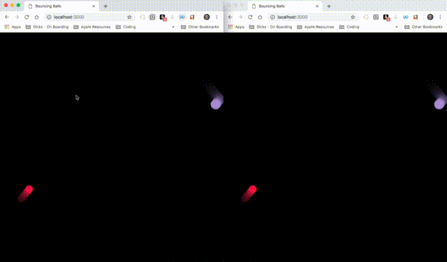

I'm feeling very inspired here at SpringOne Platform. There's a lot of hype around reactive programing with streaming data.

Some of the sessions inspired me to make a small game using web sockets. So here's Bounce:

Every time a user clicks or touches, it creates a ball. That same ball also appears on the screen of the other players and its done over web sockets.
For the server, I used node with socket.io as the web socket package and the front end is just an HTML canvas with some javascript that draws and manages the balls.
What was awesome is that I was able to create the whole thing in such a short amount of time.
The code is available here: https://github.com/cacodev/bounce
